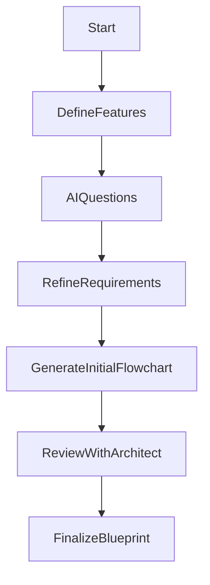
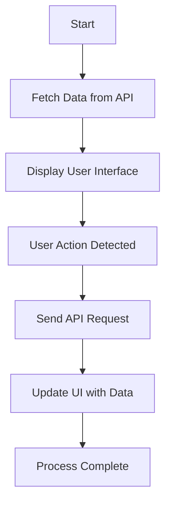
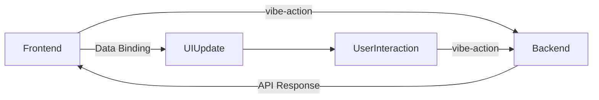

# VIBE: Visual Interactive Build Experience

## Introduction

VIBE (Visual Interactive Build Experience) is a **proposal** aimed at the software development community, suggesting a novel methodology that prioritizes architectural design and leverages AI-driven automation. Traditional coding methods often require deep programming expertise, significant manual effort, and iterative testing, leading to inefficiencies and a high risk of errors.

VIBE endeavors to shift this paradigm by employing advanced AI techniques to transform detailed flowcharts and design assets into fully functional, platform-specific code. The overarching purpose is to enable architects, non-coders, and stakeholders to concentrate on high-level design and logic rather than boilerplate coding tasks.

### Who Is the Target Audience?

- **Software Architects and Engineers:** Professionals seeking to streamline the progression from conceptual architecture to executable code.
- **Technical Project Managers:** Individuals requiring a strategic overview of the system without delving into low-level implementation details.
- **Non-Coders and Stakeholders:** Business analysts or domain experts who aspire to shape software design decisions without extensive programming knowledge.
- **Educators and Researchers:** Institutions or individuals exploring innovative strategies to teach or investigate software engineering.
- **Open-Source Community:** Developers eager to experiment with a local, AI-assisted methodology to foster collaborative improvements.

This white paper outlines the core ideas behind VIBE, including AI-assisted brainstorming, flowchart creation, backend service compilation, and frontend integration. It also details the role of open-source, locally deployable language models, underscores a fully output-agnostic compilation process, and provides structural guidelines for the flowchart format.

---

## Problem Statement

Software development frequently necessitates translating conceptual designs and business logic into source code through a labor-intensive, error-prone method. This workflow often limits the contributions of individuals outside traditional developer roles, such as business analysts or UX designers.

VIBE aspires to mitigate these issues by advocating a more architectural, visual approach, where code generation is driven by robust flowchart documentation. Furthermore, existing AI-based solutions commonly depend on proprietary, cloud-hosted language models, which may entail limitations around privacy, financial costs, and control over the operating environment. VIBE suggests adopting locally deployable open-source models, thereby maintaining data sovereignty and supporting development settings that demand stringent security or offline capabilities.

---

## Methodology

This proposal lays out a step-by-step strategy for harnessing AI-powered, flowchart-driven software creation. Below is an overarching summary of the methodology before diving into the intricacies:

1. **AI-Assisted Brainstorming** – Collaborate with an AI to specify the application’s features, user interactions, and logic.
2. **Flowchart-Driven Architecture** – Produce a machine-readable flowchart that operates as the foundational project blueprint.
3. **Backend Compilation** – Convert the flowchart into backend services, compiling them into WebAssembly or native libraries.
4. **Frontend Integration** – Construct a baseline user interface (when necessary) with essential functionality, deferring all styling or UI enhancements to developers.
5. **Local Development & Open-Source LLMs** – Emphasize the use of fine-tuned, open-source AI models running on local infrastructure.
6. **Output-Agnostic Compilation** – Retain full freedom to target any platform or framework without vendor constraints.

### 1. AI-Assisted Brainstorming

VIBE’s approach begins with a collaborative brainstorming phase, where an AI tool assists architects in cataloging the system’s features, pathways, and business logic. The AI functions as a knowledgeable guide, prompting deeper consideration of overlooked complexities and proposing best-practice alternatives for issues like user authentication, inventory handling, or payment processing.

#### Example Scenario: E-Commerce Application

- **Architect Input:** "I need an online store with product listings, a shopping cart, and a checkout process."
- **AI Prompts:**
  - "How will you handle out-of-stock items?"
  - "What is your approach for user authentication during checkout?"
  - "Would you like to integrate automated order confirmation emails?"
  - "Which payment gateways are required?"



---

### 2. Flowchart-Driven Architecture

Once the brainstorming is complete, VIBE employs the AI to generate an exhaustive flowchart that captures the entire scope of the application. Unlike typical diagramming approaches, these flowcharts are machine-readable (e.g., JSON or XML) and intricately connected to code generation.

- **Logical Nodes:** Represent data flows and decision structures.
- **UI Nodes:** Provide placeholders for user-interface components, allowing design flexibility.
- **Integration Nodes:** Manage communication with external APIs, databases, or libraries.
- **Conditional Nodes:** Capture complex branching logic, states, and concurrency controls.

#### Widely Used Flowchart Schema

To guarantee compatibility with existing tools, VIBE encourages adopting recognized frameworks like BPMN (Business Process Model and Notation) or UML Activity Diagrams. Such schemas enjoy wide support across numerous visual editors and offer:

- **Consistency:** Standardized symbols to represent processes and data flows.
- **Accessibility:** An extensive ecosystem of editors and plugins for collaborative development.
- **Scalability:** The capacity to scale from simple sequences to elaborate, enterprise-level workflows.



---

### 3. Backend Compilation

The AI compiler’s next step is to interpret the flowchart data and compile backend services. These services can be delivered as WebAssembly modules for browser contexts or packaged as native libraries for mobile and desktop environments.

Specific attributes of this phase include:

- **API Endpoint Generation:** The compiler automatically constructs endpoints derived from logical nodes in the flowchart.
- **Event-Driven Logic:** System behaviors are triggered by `vibe-action` directives that drive server-side operations.
- **Data Management:** VIBE’s backend approach centralizes caching, transaction handling, and synchronization.
- **Service Variety:** RESTful APIs, GraphQL, microservices, or serverless architectures are all viable outputs.
- **SDK Integration:** Flowchart nodes can outline how third-party tools (e.g., analytics, payment gateways) integrate.



---

### 4. Frontend Integration (For Applications with a UI)

Some applications do not require a graphical user interface—perhaps they are command-line tools or automated backend workflows. However, for those that do, VIBE assembles a rudimentary UI containing minimal elements and functional placeholders.

This bare-bones structure ensures the frontend can still operate end-to-end without imposing stylistic or design constraints. Developers are free to refine or replace these elements with any framework or design library.

#### Bare-Bones Output and Non-Destructive Updates

To empower developers, the compiler generates a baseline UI with event handlers and placeholders that reflect the flowchart’s logic. No styling, advanced interaction patterns, or visual flourishes are included. In iterative builds, VIBE updates only these AI-generated segments, leaving any developer-added code or stylistic changes intact.

```html
<ul vibe-for="task in tasks">
    <li vibe-bind:key="task.id">
        <span>{{task.name}}</span>
        <button vibe-action="removeTask" vibe-bind:value="task.id">Remove</button>
    </li>
</ul>
```

---

### 5. Local Development & Open-Source LLMs

VIBE **should** prioritize local development by utilizing fine-tuned open-source Large Language Models (LLMs)—for example, Mistral or LLaMA—running on a user’s machine or within a confidential network. By advocating this setup:

- **Data Privacy:** Proprietary code, sensitive logic, and intellectual property remain entirely in-house.
- **Cost Control:** Teams avoid perpetual licensing or usage fees linked to cloud-based AI platforms.
- **Customization Potential:** Developers can adapt the LLM to project-specific domain knowledge or coding guidelines.
- **Offline Capability:** This approach suits locked-down or bandwidth-constrained environments where cloud access is restricted.

By suggesting the use of local, open-source AI, VIBE aims to address the diverse needs of industries where security, budget, or legal compliance demands an offline or fully private setup.

---

### 6. Output-Agnostic Compilation

A major pillar of VIBE is **output agnosticism**. The compiler is designed to target multiple runtime environments, ensuring developers can choose the best fit for each project. These options include:

- **WebAssembly Modules:** Deployed in modern browsers for near-native performance.
- **Native Libraries:** Integrated into mobile apps (iOS, Android) or traditional desktop systems.
- **Intermediate Code:** Allowing developers to add manual optimizations or incorporate specialized SDKs.

This flexibility means teams can select any technology stack—be it React Native, Swift, Kotlin, .NET, or frameworks like Next.js or Astro—without refactoring the fundamental architecture.

---

## Key Benefits

1. **Democratizing Software Development:** By shifting emphasis to architectural design, VIBE creates opportunities for non-developers to engage meaningfully.
2. **Cross-Platform Flexibility:** Generated services are readily adaptable to web, mobile, or desktop platforms, giving developers broad freedom in picking frontend frameworks.
3. **Enhanced Efficiency:** Visual flowcharts and AI-driven code generation reduce overall development time and lessen the chance of manual errors.
4. **Optimized Performance:** Build-time strategies like code splitting, lazy loading, and minification can be automatically applied.
5. **Scalability and Maintainability:** Flowchart-driven logic offers a clear blueprint that remains comprehensible and modifiable as projects expand.
6. **Local Development Focus:** Emphasizing offline-capable, open-source AI models helps maintain security and lowers operational expenses.

---

## Use Cases

- **Enterprise Software:** Larger companies with stringent data handling policies can adopt local LLMs for robust, scalable applications.
- **Startup and MVP Development:** Rapid prototyping and reduced coding overhead support accelerated go-to-market strategies.
- **Educational Tools:** Classroom or research environments benefit from a visual-first, architectural approach.
- **Automation and Integration:** Workflows and pipelines that require hooking into numerous external services can be orchestrated via explicit integration nodes.
- **Privacy-Sensitive Industries:** Hospitals, banks, and government agencies can operate fully offline with no external data exposure.

---

## Challenges and Solutions

- **Third-Party Integrations:** Intermediate compilation layers accommodate custom code inserts or SDK usage without structural disturbance.
- **UI Customizations:** The compiler deliberately restricts re-generation to the AI-authored code, preserving user-defined components.
- **Preventing UI Reset:** A built-in diffing mechanism ensures new builds do not overwrite existing developer enhancements.
- **Model Fine-Tuning Overhead:** Training large language models locally can be hardware-intensive. VIBE suggests solutions like quantization or partial model loading to mitigate high resource demands.

---

## Summary

VIBE represents a forward-looking **proposal** that envisions an AI-driven, flowchart-oriented approach to software development. By focusing on open-source, locally hosted LLMs, it addresses concerns regarding data privacy, cost management, and regulatory compliance.

Its commitment to output-agnostic compilation ensures developers retain complete freedom over their technology stacks. Through bare-bones frontend generation, VIBE encourages seamless integration of custom designs while minimizing the risk of code conflicts.

Ultimately, the objective is to democratize the development lifecycle by converting architectural insight—expressed via widely recognized flowchart standards—into functional, maintainable applications. If embraced by the broader software community, VIBE could catalyze a shift in how development processes are orchestrated, granting architects and stakeholders a clearer path from conceptual flowcharts to operational systems.

By uniting local AI models, standard flowchart schemas, and non-destructive compilation practices, this proposal aspires to reduce complexity while opening new avenues for collaboration and innovation.
