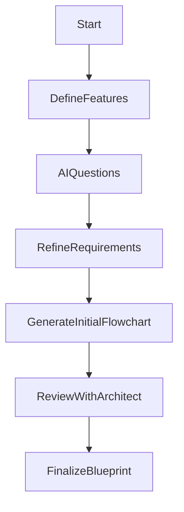
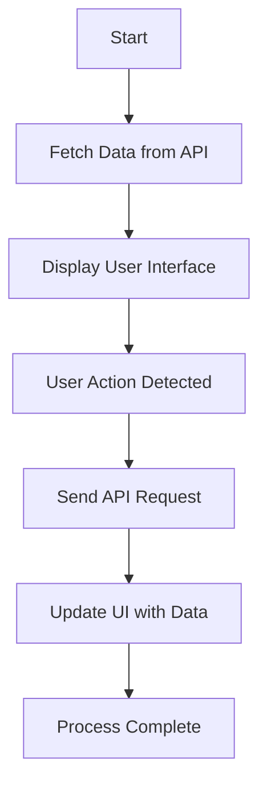
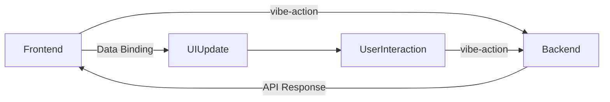

# VIBE: Visual Interactive Build Experience

## Introduction

VIBE (Visual Interactive Build Experience) introduces a novel methodology to software development by prioritizing architectural design and leveraging AI-driven automation. Traditional coding methods often require deep programming expertise, significant manual effort, and iterative testing, which can lead to inefficiencies and errors. VIBE transforms this paradigm by utilizing advanced AI to convert detailed flowcharts and design assets into fully functional, platform-specific code, allowing architects and non-coders to focus on high-level design and logic.

This white paper delves into the VIBE methodology, including AI-assisted brainstorming, flowchart creation, backend service compilation, and frontend integration. It also presents technical insights, real-world use cases, and detailed examples, showcasing how VIBE democratizes software development and supports multi-platform deployment.

---

## Problem Statement

Software development traditionally involves translating architectural plans and business logic into code manually. This labor-intensive process is not only prone to human error but also restricts the involvement of non-developers in the development process. By shifting the focus from coding to architectural design, VIBE reduces these barriers, enhancing productivity and providing a language-agnostic solution that ensures consistent results across diverse platforms.

---

## Methodology

### 1. AI-Assisted Brainstorming

The VIBE process begins with a brainstorming session where the architect works with the AI to outline the application's features, interactions, and logic. During this phase, the AI acts as a technical consultant, prompting the architect to think through every process and interaction. The AI's advanced reasoning capabilities allow it to identify potential design gaps, ask critical questions, and propose solutions.

#### Example Scenario: E-Commerce Application
- **Architect Input:** "I need an online store with product listings, a shopping cart, and a checkout process."
- **AI Prompts:**
  - "How will you handle out-of-stock items?"
  - "What is your approach for user authentication during checkout?"
  - "Would you like to integrate automated order confirmation emails?"
  - "Which payment gateways are required?"

##### Flowchart of the Brainstorming Process



---

### 2. Flowchart-Driven Architecture

After the brainstorming phase, VIBE generates a detailed flowchart that serves as the software’s blueprint. Unlike conventional flowcharts, VIBE's flowcharts are machine-readable documents (e.g., XML, JSON) that directly influence code generation. The flowchart comprises:
- **Logical Nodes:** Define control structures, data flow, and business logic.
- **UI Nodes:** Act as placeholders for front-end components without enforcing design specifics.
- **Integration Nodes:** Facilitate connections to external services, APIs, and SDKs.
- **Conditional Nodes:** Support complex logic, including loops, conditional rendering, and state management.

##### Example Flowchart of Application Architecture



---

### 3. Backend Compilation

The AI compiler transforms the flowchart into backend services using a backend-first approach. The backend services are then compiled into WebAssembly modules for web applications or as native libraries for mobile and desktop platforms. Key features of this process include:
- **API Endpoint Generation:** Automatically creates API endpoints based on logical nodes in the flowchart.
- **Event Handling:** Implements a backend-driven system where `vibe-action` attributes trigger server-side events directly.
- **State and Data Management:** The backend handles state management and caching to maintain performance and scalability.
- **Service Types:** Supports RESTful APIs, GraphQL, WebSocket services, and serverless functions.
- **Third-Party Integration:** Specialized flowchart nodes allow seamless integration with external services and SDKs.

##### Backend and Frontend Communication Flowchart



---

### 4. Frontend Integration

VIBE generates a basic front-end UI that includes only the functional elements and event handlers required to communicate with the backend. Developers can enhance this UI with custom styles or integrate design systems while maintaining seamless backend interactions. The `vibe-*` attributes (`vibe-action`, `vibe-bind`, `vibe-for`, `vibe-if`) provide a consistent model for event handling and data binding across platforms.

#### Example Frontend Code
```html
<ul vibe-for="task in tasks">
    <li vibe-bind:key="task.id">
        <span>{{task.name}}</span>
        <button vibe-action="removeTask" vibe-bind:value="task.id">Remove</button>
    </li>
</ul>
```

### 5. Handling Complex Interactions
- **Dynamic Forms:** The AI compiler can handle forms with conditional fields, dynamic content, and advanced validation rules.
- **State Management:** The backend manages the application state, offering a single source of truth for all front-end interactions.
- **Real-Time Interactions:** Supports dynamic updates using WebSocket or Server-Sent Events (SSE).

---

## Key Benefits

- **Democratizing Software Development:** By focusing on architecture and design, VIBE enables non-coders to participate in the development process.
- **Cross-Platform Flexibility:** The backend services can be compiled into any platform, providing developers with the freedom to choose their preferred front-end framework.
- **Enhanced Efficiency:** Automating code generation through detailed flowcharts significantly reduces development time and manual coding errors.
- **Optimized Performance:** The AI compiler applies advanced build optimizations such as code splitting, lazy loading, and minification.
- **Scalability and Maintainability:** The flowchart-driven approach ensures the software remains adaptable to changing business requirements.

---

## Use Cases

- **Enterprise Software Development:** Build robust and scalable enterprise applications with minimal manual coding.
- **Startup and MVP Prototyping:** Quickly generate prototypes and bring new ideas to market efficiently.
- **Educational Tools:** Allow educators to demonstrate software development principles using a visual-first methodology.
- **Automation and Integration Tools:** Create backend services for automated workflows and integrate with platforms like Zapier or Make.

---

## Challenges and Solutions

- **Third-Party Integrations:** VIBE allows inserting custom code and SDKs through intermediate compilation layers without disrupting the architecture.
- **UI Customizations:** During re-compilation, the AI updates only the logic bindings, preserving all custom styles and design elements.
- **Preventing UI Reset:** A diffing algorithm is used to ensure that custom UI elements are not overridden during iterative development.

---

## Conclusion

VIBE modernizes software development by enabling architects to transform detailed flowcharts into fully functional applications across any platform. The integration of advanced AI for architectural scrutiny, backend-first compilation, and platform-agnostic frontend interaction creates a streamlined and efficient development process. By bridging the gap between architectural design and code generation, VIBE democratizes software development, empowering a diverse array of creators to build, innovate, and bring their software visions to life efficiently.

